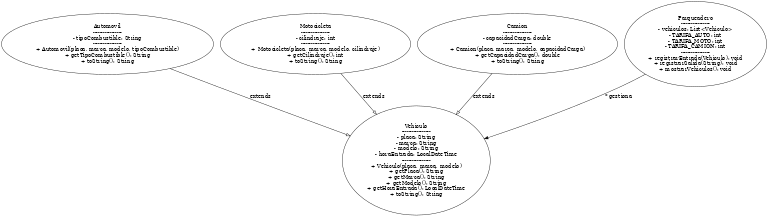

# 🚗 Gestión de Parqueadero

Este proyecto implementa un sistema en Java para la gestión de un parqueadero, permitiendo registrar la entrada y salida de vehículos, calcular el tiempo de permanencia y el valor a pagar según tarifas por tipo de vehículo.

## 📌 Características
- Registro de **entrada** de vehículos (Automóvil, Motocicleta, Camión).
- Registro de **salida** con cálculo automático de horas y cobro.
- Visualización de vehículos presentes en el parqueadero.
- Uso de **POO**: herencia, polimorfismo y encapsulamiento.
- Estructura de paquetes organizada:

  src/

  ├── modelo/

  ├── servicio/

  └── app/

## 📂 Estructura de clases
- **Vehiculo** (clase base)
- **Automovil**, **Motocicleta**, **Camion** (subclases)
- **Parqueadero** (gestión de operaciones)
- **Main** (menú interactivo)

## 🖼 Diagrama UML

## ⚙️ Ejecución
1. Clonar el repositorio:

 git clone <https://github.com/srodrigueztorres/GestionDeUnParqueadero>

2. Abrir el proyecto en IntelliJ IDEA.

3. de usar Java 8 o superior.

4. Ejecutar la clase Main.java (paquete app).

##💰 Tarifas por hora
Automóvil: $5,000

Motocicleta: $3,000

Camión: $10,000

##📄 Ejemplo de uso
=== MENÚ PARQUEADERO ===
1. Registrar entrada
2. Registrar salida
3. Mostrar vehículos presentes
4. Salir

Seleccione: 1

Tipo de vehículo: 1) Automóvil  2) Motocicleta  3) Camión 

Placa: ABC123

Marca: Toyota

Modelo: Corolla

Tipo de combustible: Gasolina

Vehículo registrado: [Automóvil] ABC123 - Toyota Corolla (Entrada: 2025-08-12T19:50)

##💻 Autor: Soed Alejandra Rodríguez Torres
